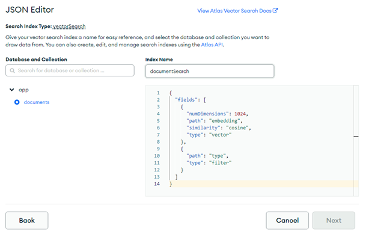

# Document Vectorizer

An easy RAG tool using MongoDB

Search Over your documents using mongodb.

# Setup:

# Venv

# Replace API Keys

# Setup MongoDB Vector Search

`{
  "fields": [
    {
      "numDimensions": 1024,
      "path": "embedding",
      "similarity": "cosine",
      "type": "vector"
    },
    {
      "path": "type",
      "type": "filter"
    }
  ]
}`

# Add Documents

